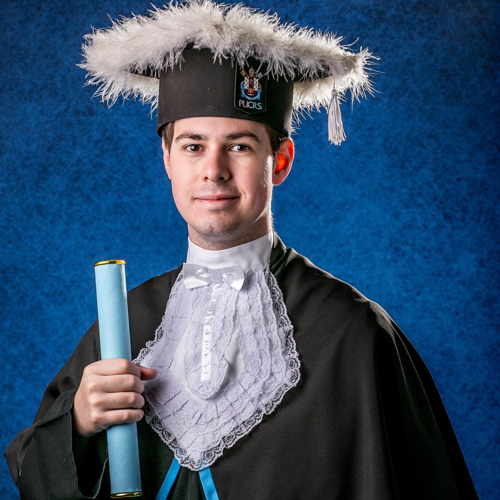

# Luiz Gustavo Pfitscher e Feldmann

  
  
  

    
 <a href="https://www.github.com/luizfeldmann">github.com/luizfeldmann</a> 

    
 <a href="https://www.linkedin.com/in/luizgustavopf">linkedin.com/in/luizgustavopf</a> 

    
 <a href="https://www.instagram.com/feldmann1">instagram.com/feldmann1</a> 

    
 <a href="https://www.youtube.com/@luizgustavopf">youtube.com/@luizgustavopf</a> 

  

---

## Education

Institution | Degree
:-----------|:--------------------------------------------------------|
**PUCRS**   | **Pontifical Catholic University of Rio Grande do Sul**
2015 - 2020 | Bachelor’s degree in *Mechanical Engineering*
2021 - 2022 | Postgraduate degree in *Human Resources Management*
**UFRGS**   | **Federal University of Rio Grande do Sul**
2015 - now  | Bachelor’s degree in *Electrical Engineering*

## Experience

Company | Info
:-|:-
**AEL Sistemas**    | Porto Alegre, Brazil
Mar/23 - now        | Design of user interfaces in Qt and development of libraries for control of video conversion hardware.
**Elbit Systems**   | Netanya, Israel
Mar/22 - Mar/23     | Development of software for military aviation training and simulation in *C++*.
**AEL Sistemas**    | Porto Alegre, Brazil
May/21 - Mar/22     | Design of user interfaces in *Qt* and development of *C++* libraries for control of video conversion hardware.
**TDK Electronics** | Gravataí, Brazil
Dec/18 - Aug/19     | Process engineering for film capacitor production: continuous improvement projects focused on computer vision systems for quality control using *NI LabView*.
**NT-Solar**        | Porto Alegre, Brazil
Mar/18 - Dec/18     | Research and development of silicon solar cell's production processes, measurements and sample characterization in clean room environment, data analysis and scientific paper publishing.

## Awards

* Academic **Laureate** Award in *Mechanical Engineering* at *PUCRS*.

## Highlights

* **Graduation Project**: Piano playing robot (*on Youtube*)
 
